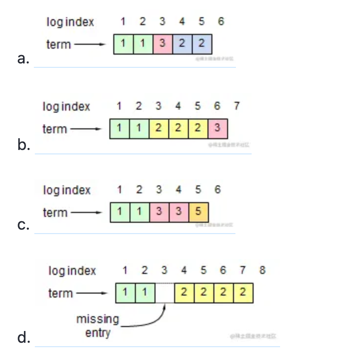
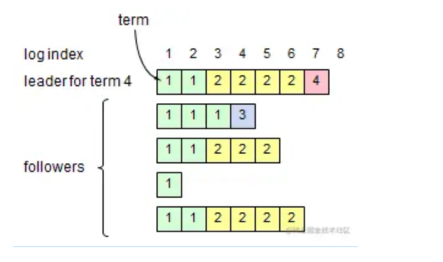
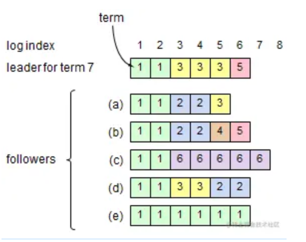

# Raft 面试题
1.1、Raft分为哪几个部分？
主要是分为leader选举、日志复制、日志压缩、成员变更等。

1.2、Raft中任何节点都可以发起选举吗？
Raft发起选举的情况有如下几种：

刚启动时，所有节点都是follower，这个时候发起选举，选出一个leader；
当leader挂掉后，时钟最先跑完的follower发起重新选举操作，选出一个新的leader。
成员变更的时候会发起选举操作。
1.3、Raft中选举中给候选人投票的前提？
Raft确保新当选的Leader包含所有已提交（集群中大多数成员中已提交）的日志条目。

这个保证是在RequestVoteRPC阶段做的，candidate在发送RequestVoteRPC时，会带上自己的last log entry的term_id和index，follower在接收到RequestVoteRPC消息时，如果发现自己的日志比RPC中的更新，就拒绝投票。
参考资料：flower日志比较的方法

1.4、Raft网络分区下的数据一致性怎么解决？
发生了网络分区或者网络通信故障，使得Leader不能访问大多数Follwer了，那么Leader只能正常更新它能访问的那些Follower，而大多数的Follower因为没有了Leader，他们重新选出一个Leader，然后这个 Leader来接受客户端的请求，如果客户端要求其添加新的日志，这个新的Leader会通知大多数Follower。如果这时网络故障修复 了，那么原先的Leader就变成Follower，在失联阶段这个老Leader的任何更新都不能算commit，都回滚，接受新的Leader的新的更新（递减查询匹配日志）。

1.5、Raft数据一致性如何实现？
主要是通过日志复制实现数据一致性，leader将请求指令作为一条新的日志条目添加到日志中，然后发起RPC 给所有的follower，进行日志复制，进而同步数据。

1.6、Raft的日志有什么特点？
日志由有序编号（log index）的日志条目组成，每个日志条目包含它被创建时的任期号（term）和用于状态机执行的命令。

1.7、Raft和Paxos的区别和优缺点？
Raft的leader有限制，拥有最新日志的节点才能成为leader
multi-paxos中对成为Leader的限制比较低，任何节点都可以成为leader。
Raft中Leader在每一个任期都有Term号。
1.8、Raft prevote机制？

Prevote（预投票）是一个类似于两阶段提交的协议，第一阶段先征求其他节点是否同意选举，如果同意选举则发起真正的选举操作，否则降为Follower角色。
这样就避免了网络分区节点重新加入集群，触发不必要的选举操作。
1.9、Raft里面怎么保证数据被commit，leader宕机了会怎样，之前的没提交的数据会怎样？
leader会通过RPC向follower发出日志复制，等待所有的follower复制完成，这个过程是阻塞的。

老的leader里面没提交的数据会回滚，然后同步新leader的数据。

1.10、Raft日志压缩是怎么实现的？增加或删除节点呢？？
在实际的系统中，不能让日志无限增长，否则系统重启时需要花很长的时间进行回放，从而影响可用性。Raft采用对整个系统进行snapshot来解决，snapshot之前的日志都可以丢弃。

snapshot里面主要记录的是日志元数据，即最后一条已提交的 log entry的 log index和term。

1.11、Raft里面的lease机制是什么，有什么作用？
租约机制确保了一个时刻最多只有一个leader，避免只使用心跳机制产生双主的问题。
中心思想是每次租约时长内只有一个节点获得租约、到期后必须重新颁发租约。

1.12、Raft协议的leader选举，正常情况下，网络抖动造成follower发起leader选举，且该follower的Term比现有leader高，集群中所有结点的日志信息当前一致，这种情况下会选举成功吗？
参考：https://www.jianshu.com/p/b28e73eefa88

------

1.（4 分）下面的每张图都显示了一台 Raft 服务器上可能存储的日志（日志内容未显示，只显示日志的 index 和任期号）。考虑每份日志都是独立的，下面的日志可能发生在 Raft 中吗？如果不能，请解释原因。  
  

2.（6 分）下图显示了一个 5 台服务器集群中的日志（日志内容未显示）。哪些日志记录可以安全地应用到状态机？请解释你的答案。  
  

3.（10 分）考虑下图，它显示了一个 6 台服务器集群中的日志，此时刚刚选出任期 7 的新 Leader（日志内容未显示，只显示日志的 index 和任期号）。对于图中每一个 Follower，给定的日志是否可能在一个正常运行的 Raft 系统中存在？如果是，请描述该情况如何发生的；如果不是，解释为什么。  
  

4.（5 分）假设硬件或软件错误破坏了 Leader 为某个特定 Follower 存储的 nextIndex 值。这是否会影响系统的安全？请简要解释你的答案。  

5.（5 分）假设你实现了 Raft，并将它部署在同一个数据中心的所有服务器上。现在假设你要将系统部署到分布在世界各地的不同数据中心的每台服务器，与单数据中心版本相比，多数据中心的 Raft 需要做哪些更改？为什么？  

6.（10 分）每个 Follower 都在其磁盘上存储了 3 个信息：当前任期（currentTerm）、最近的投票（votedFor）、以及所有接受的日志记录（log[]）。   
    a. 假设 Follower 崩溃了，并且当它重启时，它最近的投票信息已丢失。该 Follower 重新加入集群是否安全（假设未对算法做任何修改）？解释一下你的答案。  
     b. 现在，假设崩溃期间 Follower 的日志被截断（truncated）了，日志丢失了最后的一些记录。该 Follower 重新加入集群是否安全（假设未对算法做任何修改）？解释一下你的答案。  

7.（10 分）如视频中所述，即使其它服务器认为 Leader 崩溃并选出了新的 Leader 后，（老的）Leader 依然可能继续运行。新的 Leader 将与集群中的多数派联系并更新它们的任期，因此，老的 Leader 将在与多数派中的任何一台服务器通信后立即下台。然而，与此期间，它也可以继续充当 Leader，并向尚未被新 Leader 联系到的 Follower 发出请求；此外，客户端可以继续向老的 Leader 发送请求。我们知道，在选举结束后，老的 Leader 不能提交（commit）任何新的日志记录，因为这样做需要联系选举多数派中的至少一台服务器。但是，老的 Leader 是否有可能执行一个成功 AppendEntries RPC，从而完成在选举开始前收到的旧日志记录的提交？如果可以，请解释这种情况是如何发生的，并讨论这是否会给 Raft 协议带来问题。如果不能发生这种情况，请说明原因。  

8.（10 分）在配置变更过程中，如果当前 Leader 不在 C-new 中，一旦 C-new 的日志记录被提及，它就会下台。然而，这意味着有一段时间，Leader 不属于它所领导的集群（Leader 上存储的当前配置条目是 C-new，它不包括 Leader）。假设修改算法，如果 C-new 不包含 Leader，则使 Leader 在其日志存储了 C-new 时就立即下台。这种方法可能发生的最坏情况是什么？  

答案

1.
a. 不能：任期在日志里必须单调递增。
具体来说，写入日志 <4, 2> 的 Leader1 只能从当前任期 >= 3 的 Leader2 那里接收到日志 <3, 3> ，所以 Leader1 当前任期也将 >= 3，那么它就不能写入 <4, 2>
b. 可以
c. 可以
d. 不能：日志不允许空洞。 具体来说，Leader 只能追加日志，AppendEntries 中的一致性检查永远不会允许空洞。

2.
日志记录 <1,1> 和 <2,1> 可以安全应用（到状态机）：
如果一条日志记录没有存储在多数派上，它就不能被安全地应用。这是因为少数服务器可能故障，并且其它服务器（构成多数派）可以在不知道该日志记录的情况下继续运行。
因此，我们只需要考虑记录 <1,1>, <2,1>, <3,2>, <4,2>, <5,2>。
我们必须弄清楚哪些节点可以当选 Leader，然后看看它们是否会导致这些日志记录被删除。(Leader 处理不一致是通过强 Follower 直接复制自己的日志来解决的)
S2 可以被选为 Leader，因为它的日志至少和 S3、S4 和 S5 一样完整。那么它可能导致 <3,2>, <4,2> 和 <5,2> 被删除，所以这些日志记录不能被安全地应用。
所以我们只剩下 <1,1> 和 <2,1> 可能安全地应用（到状态机）。
S3 和 S4 不能被选为 Leader，因为它们的日志不够完整。S5 能被选举为 LEader，但是它包含了 <1,1> 和 <2,1> 。
因此，只有记录 <1,1> 和 <2,1> 可以被安全地应用（到状态机）

3.
(a) 不能。如果在不同的日志中的两条记录拥有相同的索引和任期号，那么他们之前的所有日志条目也全部相同。 <5, 3> 在 Leader 和 a 中都存在，但是前面的日志却不相同。
(b) 不能。同上，<6, 5> 在 Leader 和 b 中都存在，但是前面的日志却不相同。
(c) 可能。c 可能是第 6 任期的 Leader，其起始日志为 <1,1>, <2,1> 并且可能在其日志中写了一堆记录，而没有与我们第 7 任期的当前 Leader 进行通信。这也假设当前 Leader 的 <3,3>、<4,3>、<5,3>、<6,5> 这几个日志记录在第 5 任期没有被写入，这是可能的。
(d) 不能。在一个日志中，任期只能是单调递增的。
(e) 可能。例如，e 是任期 1 的 Leader，提交了日志 <1,1> 和 <2,1>，然后与其它服务器失联（网络分区），但还在继续处理客户端请求。

4.
不会。
如果 nextIndex 的值太小，Leader 将发送额外的 AppendEntries 请求。每个请求都不会对 Follower 的日志产生任何影响（它们将进行一致性检查，但不会和 Follower 日志中的记录产生冲突，也不会向 Follower 提供该 Follower 没有存储的任何日志记录），成功的响应将告诉 Leader 应该增加其 nextIndex。
如果 nextIndex 的值太大，Leader 也将发送额外的 AppendEntries 请求，对此，一致性检查将会失败，从而导致 Follower 拒绝该请求，Leader 将会递减 nextIndex 值并重试。
无论哪种方式，这都是安全的行为，因为两种情况下都不会修改关键的状态。

5.
我们需要将选举超时(election timeouts)时间设置得更长：预期的广播时间更长，选举超时时间应该比广播时间长得多，以便候选人有机会在再次超时之前完成一次选举。该算法其余部分不需要任何修改，因为它不依赖于时序。

6.
a. 不安全。这将允许一个服务器在同一任期内投票两次，这样以来，每个任期就可以有多个 Leader 参与，这几乎破坏了一切。
例如，对于 3 台服务器：

S1 获得 S1 和 S2 的投票，并且成为任期 2 的 Leader
S2 重启，丢失了它在任期 2 中投过的票(votedFor)
S3 获得 S2 和 S3 的选票，并且成为任期 2 的第二任 Leader
现在 S1 和 S3 都可以在任期 2 同一 index 的日志记录上提交不同的值。

b. 不安全。这将允许已提交的日志不被存储在多数派上，然后将允许同一 index 提交其它不同的值。 例如，对于 3 台服务器：

S1 成为任期 2 的 Leader，并在自己和 S2 上追加写了 index=1, term=2, value=X，并设置 committedIndex=1，然后返回已提交的值 X 给客户端
S2 重启，并且丢失了其日志中的记录
S3（具有空的日志）成为任期 3 的 Leader，因为它的空日志也至少与 S2 一样完整。S3 在自己和 S2 上追加写 index=1, term=3, value=Y，并设置committedIndex=1，然后返回已提交的值 Y 给客户端

7.
可能。仅当新 Leader 也包含正在提交的日志时，才会发生这种情况，所以不会引起问题。
下面是一个在 5 台服务器发生这种情况的例子：

带有空日志的 S1 成为任期 2 的 Leader，票选来自 S1，S2 和 S3
S1 将 index=1, term=2, value=X 追加写到它自己和 S2
S2 的日志中包含 index=1, term=2, value=X，S2 成为任期 3 的 Leader，票选来自 S2，S4 和 S5
S1 将 index=1, term=2, value=X 追加写到 S3
此时，S1 已经完成了对 index=1, term=2, value=X 的提交，即使它不再是当前任期的 Leader

这种行为是安全的，因为任何新的 Leader 也必须包含该日志记录，因此它将永远存在。
该日志记录必须存储在给新 Leader（记为 L）投票的服务器 S 上，并且必须在 S 给新 Leader 投票之前存储在 S 上，日志完整性会检测，S 只能在以下情况投票给 L： L.lastLogTerm > S.lastLogTerm 或者 (L.lastLogTerm == S.lastLogTerm and L.lastLogIndex >= S.lastLogIndex)
如果 L 是 S 之后的第一任 Leader，那么我们必须处于第二个条件下，那么 L 一定包含了 S 拥有的所有日志记录，包括我们担心的那个记录。
如果 L' 是 S 之后的第二任 Leader，那么 L' 只有从 L 那里接收到了日志，它最新的任期号才可能比 S 大。但是 L 在把自己的日志复制到 L' 时也一定已经把我们担心的那条日志复制到 L' 了，所以这也是安全的。
而且，这个论点对未来所有的 Leader 都成立。

8.
根据对算法的理解，有两种可能的正确答案。
答案 1: 假设一个不错的实现——一旦一个服务器不再属于其当前配置，它就不会再成为 Candidate。问题在于，C-old 中的另一台服务器可能会被选为 Leader，在其日志中追加 C-new，然后立即下台。
更糟糕的是，这种情况可能会在 C-old 的多数派服务器上重复。一旦超过半数 C-old 存储了 C-new 条目，它就不能再重复了。由于日志完整性检查，没有 C-new 这条日志记录的 C-old 中的任何服务器都不能当选（超过半数的 C-old 需要日志 C-old+new，不会再给没有 C-new 这条日志记录的服务器投票。）
在这之后，C-new 中的某台服务器必须当选，集群就会继续运行。所以最坏的情况其实只是跑了最多大约 |C-old|/2 次额外的选举和选举超时。
答案 2: 假设一个朴素的（naive）实现，仍允许一个不属于其当前配置的服务器成为 Candidate，在这种情况下，最坏的情况是， Leader 一下台就再次当选（它的日志仍然是完整的），然后再下台，然后无限重复。
